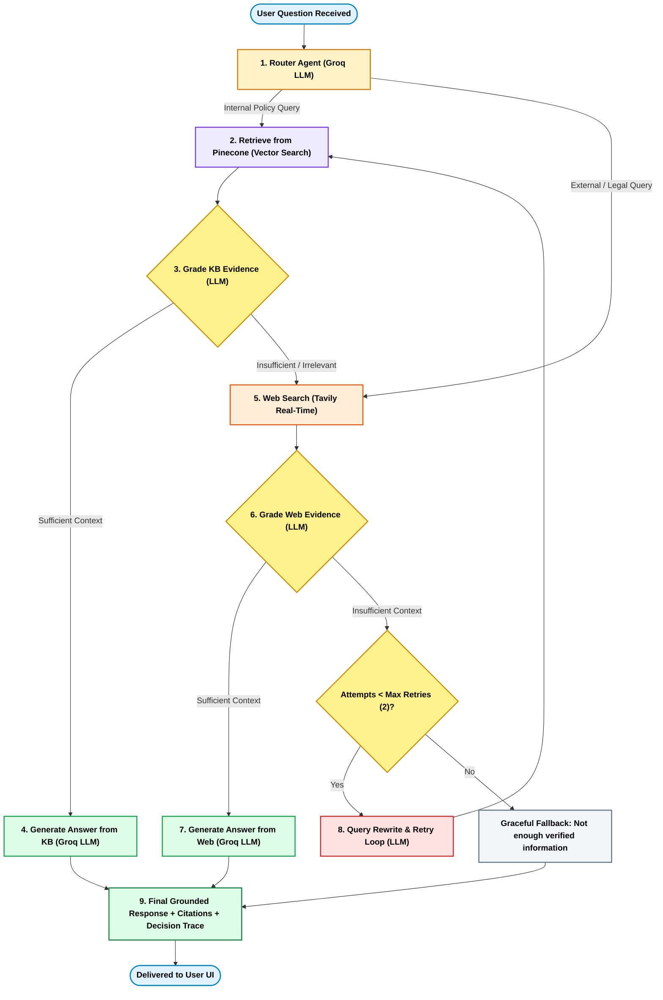

# Enterprise HR AI Copilot — Agentic RAG Platform

[](https://fastapi.tiangolo.com)
[](https://langchain-ai.github.io/langgraph/)
[](https://groq.com)
[](https://www.pinecone.io)
[](https://huggingface.co)
[](https://www.docker.com)
[](https://render.com)

A production-grade, enterprise-ready **HR AI Copilot** powered by **LangGraph Agentic RAG**, **FastAPI**, **Pinecone**, **Groq**, and **Tavily**. 

The copilot autonomously routes questions between internal company HR policy documents (PDF, DOCX, TXT) and live web searches for external labor laws, grades retrieved evidence for relevance, self-corrects ambiguous queries via an iterative rewrite loop, and generates grounded answers with inline citations and transparent decision traces.

---

## 🏛️ System Architecture

### 1. High-Level Architecture Overview

```
                                  ┌────────────────────────────────┐
                                  │      Client (Web Browser)      │
                                  │  - Modern Chat UI (HTML/CSS/JS)│
                                  │  - Admin Ingestion Portal      │
                                  │  - Interactive Decision Trace  │
                                  └───────────────┬────────────────┘
                                                  │ HTTP / JSON
                                                  ▼
┌──────────────────────────────────────────────────────────────────────────────────────────────────┐
│                                   FASTAPI APPLICATION BACKEND                                    │
│                                                                                                  │
│   ┌─────────────────────┐       ┌──────────────────────┐       ┌─────────────────────────────┐   │
│   │   REST API Layer    │       │     Static Files     │       │   Admin Ingestion Service   │   │
│   │  /chat    /feedback │       │  index.html, app.js  │       │  - PyMuPDF / python-docx    │   │
│   │  /health  /logs     │       │  style.css           │       │  - Sanitizer & Chunker      │   │
│   └──────────┬──────────┘       └──────────────────────┘       └──────────────┬──────────────┘   │
│              │                                                                │                  │
│              ▼                                                                ▼                  │
│   ┌─────────────────────────────────────────────────────────┐  ┌─────────────────────────────┐   │
│   │               LangGraph StateGraph Engine               │  │  Hugging Face Router API    │   │
│   │   Stateful 9-Node Agentic Routing & Verification Flow   │  │  (BAAI/bge-large-en-v1.5)   │   │
│   └──────────────────────────┬──────────────────────────────┘  └──────────────┬──────────────┘   │
└──────────────────────────────┼────────────────────────────────────────────────┼──────────────────┘
                               │                                                │
           ┌───────────────────┴───────────────────┐                            │ 1024-dim
           ▼                                       ▼                            ▼ Vectors
┌─────────────────────┐                 ┌─────────────────────┐      ┌─────────────────────┐
│      Groq API       │                 │   Tavily Web API    │      │ Pinecone Vector DB  │
│   (qwen/qwen3.8)    │                 │ (Real-Time Fallback)│      │  ('ragbot' Index)   │
│ Routing & Synthesis │                 │  External Law Search│      │  Cosine Similarity  │
└─────────────────────┘                 └─────────────────────┘      └─────────────────────┘
```

---

### 2. LangGraph Agentic RAG Workflow

The core reasoning engine is built on a compiled LangGraph `StateGraph(AgentState)` featuring autonomous routing, relevance grading, and adaptive self-correction:



---

### 3. Automated Document Ingestion Pipeline

When an admin uploads a file via the Admin Portal:

```
  Uploaded Document (.pdf, .docx, .txt)
                    │
                    ▼
       Document Loader (PyMuPDF / python-docx)
                    │
                    ▼
         Text Sanitization & Cleaner
                    │
                    ▼
     Recursive Character Text Splitter (700 chars / 120 overlap)
                    │
                    ▼
     Dense Embeddings via Hugging Face Router API
         Model: BAAI/bge-large-en-v1.5 (1024 dimensions)
                    │
                    ▼
     Pinecone Vector Store Upsert ('ragbot' index)
         Payload: text chunk, filename, page number, document ID
                    │
                    ▼
     Instantly Queryable by All Users in /chat
```

---

## ✨ Key Capabilities

| Feature | Description |
| :--- | :--- |
| **Autonomous Router** | Differentiates internal company policy inquiries from general external labor law queries. |
| **Hallucination Prevention** | Two-tier relevance grading (KB & Web evidence) prevents hallucinated answers. |
| **Iterative Query Rewriting** | Ambiguous queries are automatically reformulated and retried up to 2 times. |
| **Verified Source Provenance** | Every response includes document filename, page number, or external web URLs. |
| **Transparent Decision Trace** | Full visibility into the agent's internal reasoning and routing steps. |
| **Admin Ingestion Portal** | Secure document upload with automatic parsing, chunking, embedding, and vector upserting. |
| **Auditing & Feedback Loop** | Thumbs up/down user feedback and decision trace logs persisted to disk. |
| **Cloud Vector Integration** | Pinecone serverless vector database ensures embeddings persist across server restarts. |

---

## 📁 Project Structure

```text
rag-project/
├── app/
│   ├── __init__.py
│   ├── config.py             # Pydantic Settings with multi-alias env support
│   ├── schemas.py            # Pydantic request/response models & AgentState TypedDict
│   ├── embeddings.py         # Hugging Face Router API client (1024-dim BGE-Large)
│   ├── vectorstore.py        # Pinecone Vector Store wrapper (cosine similarity)
│   ├── tavily_client.py      # Tavily real-time web search fallback client
│   ├── rag.py                # Standard RAG & Groq LLM client (qwen/qwen3.8-27b)
│   ├── advanced_rag.py       # Query rewriter & evidence noise filter
│   ├── agentic_rag.py        # Compiled LangGraph 9-node Agentic RAG StateGraph
│   ├── main.py               # FastAPI application, CORS, endpoints & static UI mount
│   ├── ingestion/
│   │   ├── __init__.py       # Ingestion module interface
│   │   ├── loader.py         # PDF (PyMuPDF), DOCX (python-docx), TXT loaders
│   │   ├── cleaner.py        # Text sanitization and formatting normalizer
│   │   ├── chunker.py        # Recursive character chunker with provenance
│   │   └── pipeline.py       # End-to-end ingestion orchestrator
│   └── static/
│       ├── index.html        # Single-page modern chat UI & Admin modal
│       ├── style.css         # Responsive styling, animations & theme
│       └── app.js            # Frontend logic, trace viewer, upload handler
├── data/                     # Persistent storage for audit logs & feedback
│   └── .gitkeep
├── notebooks/
│   └── letsdo.ipynb          # Step-by-step interactive development notebook
├── uploads/                  # Uploaded policy documents (PDF, DOCX, TXT)
├── Dockerfile                # Production multi-stage Dockerfile (non-root user)
├── docker-compose.yml        # Docker Compose configuration with volume mounts
├── render.yaml               # Render Infrastructure-as-Code Blueprint
├── requirements.txt          # Python dependencies
├── .env.example              # Environment variables template
└── README.md                 # Complete documentation
```

---

## 🚀 Getting Started

### Prerequisites
- **Python 3.11+**
- **Docker Desktop** (optional, for containerized running)
- API Keys:
  - [Groq Console](https://console.groq.com) (LLM Inference)
  - [Hugging Face](https://huggingface.co/settings/tokens) (Embeddings)
  - [Pinecone](https://app.pinecone.io) (Vector Database — index: `ragbot`, 1024 dimensions, cosine metric)
  - [Tavily](https://tavily.com) (Real-Time Web Search)

---

### Local Installation

1. **Clone the repository:**
   ```bash
   git clone https://github.com/dhairya22157/agentic-rag-hr-copilot.git
   cd agentic-rag-hr-copilot
   ```

2. **Create and activate a virtual environment:**
   ```powershell
   # Windows PowerShell:
   python -m venv venv
   .\venv\Scripts\Activate.ps1

   # macOS / Linux:
   python3 -m venv venv
   source venv/bin/activate
   ```

3. **Install dependencies:**
   ```bash
   pip install -r requirements.txt
   ```

4. **Configure environment variables:**
   Copy `.env.example` to `.env` and enter your credentials:
   ```bash
   cp .env.example .env
   ```

   ```env
   GROQ_API_KEY=gsk_your_groq_key
   GROQ_MODEL=qwen/qwen3.8-27b

   HUGGINGFACEHUB_API_TOKEN=hf_your_token
   EMBEDDING_MODEL=BAAI/bge-large-en-v1.5
   EMBEDDING_DIMENSION=1024

   PINECONE_API_KEY=your_pinecone_key
   PINECONE_INDEX_NAME=ragbot

   TAVILY_API_KEY=tvly-your_tavily_key

   ADMIN_USERNAME=admin
   ADMIN_PASSWORD=your_secure_password
   ```

5. **Start the application:**
   ```powershell
   uvicorn app.main:app --host 0.0.0.0 --port 8000 --reload
   ```

6. **Open in your browser:**
   - **Web UI**: [http://localhost:8000](http://localhost:8000)
   - **Swagger Docs**: [http://localhost:8000/docs](http://localhost:8000/docs)

---

## 🐳 Running with Docker

The project includes a production-ready container setup with health checks and persistent volume mounts.

### Build and Start:
```powershell
docker compose up -d --build
```

### View Live Logs:
```powershell
docker compose logs -f
```

### Check Container Status:
```powershell
docker compose ps
```

### Stop Container:
```powershell
docker compose down
```

> **Data Persistence:** Uploaded documents (`./uploads/`) and user feedback (`./data/`) are mounted as persistent volumes on the host system, so data survives container restarts.

---

## ☁️ Deploying to Render

The repository includes a [`render.yaml`](render.yaml) Blueprint for automated 1-click cloud deployment:

1. Push your repository to GitHub:
   ```powershell
   git add .
   git commit -m "Deploy to Render"
   git push origin main
   ```
2. Log into **[Render.com](https://dashboard.render.com)**.
3. Click **New +** $\rightarrow$ **Blueprint** and select your repository.
4. Render will parse `render.yaml` and prompt you to input your secret environment variables:
   - `GROQ_API_KEY`
   - `HUGGINGFACEHUB_API_TOKEN` *(or `HF_TOKEN`)*
   - `PINECONE_API_KEY`
   - `PINECONE_INDEX_NAME` (`ragbot`)
   - `TAVILY_API_KEY`
   - `ADMIN_PASSWORD`
5. Click **Apply**. Render will automatically build the Docker container and deploy your live service at:
   ```
   https://<your-service-name>.onrender.com
   ```

---

## 🔌 API Reference

| Method | Endpoint | Description | Request Body / Params |
| :--- | :--- | :--- | :--- |
| `POST` | `/chat` | Execute LangGraph Agentic RAG query | `{"question": "How many days of casual leave do I get?"}` |
| `POST` | `/upload` | Admin upload with auto-chunking & vector indexing | Multipart Form: `file`, `username`, `password` |
| `POST` | `/ingest` | Batch re-index all files in `uploads/` | None |
| `GET` | `/admin/docs` | List indexed documents and Pinecone vector count | None |
| `POST` | `/feedback` | Submit thumbs up/down user satisfaction | `{"question": "...", "answer": "...", "rating": "up"}` |
| `GET` | `/logs` | View recent query decision traces | Query param: `?limit=20` |
| `GET` | `/health` | Service health status and API key diagnostics | None |
| `GET` | `/` | Serves the single-page Frontend Web UI | None |

---

## 🔐 Admin Portal Access

The Admin Portal enables authorized administrators to upload company HR policies (`.pdf`, `.docx`, `.txt`) with real-time text sanitization, recursive chunking, and automated vector indexing into Pinecone.

> [!NOTE]
> In case you want to test the admin portal, please mail me to request demo credentials.
>
> *(For self-hosted instances, you can configure your own `ADMIN_USERNAME` and `ADMIN_PASSWORD` in your `.env` file or Render Environment tab).*

---

## 🛡️ License

This project is licensed under the MIT License — feel free to adapt it for your enterprise needs.
